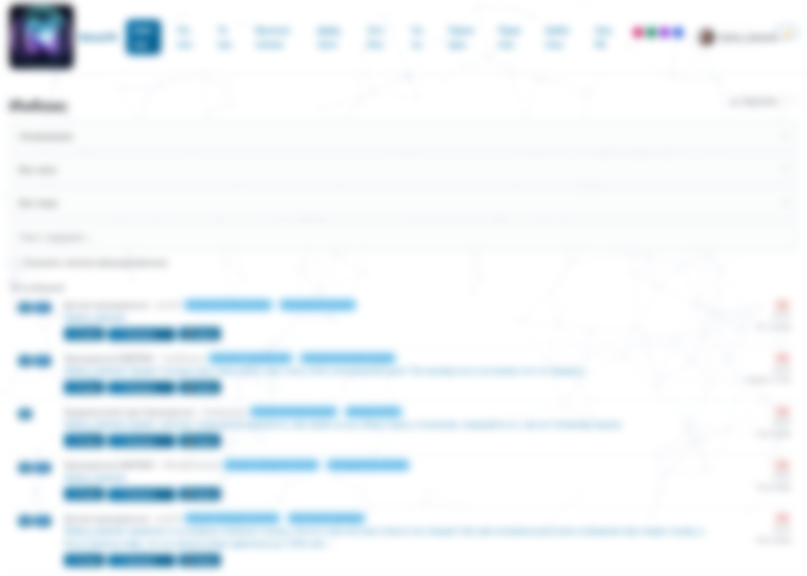
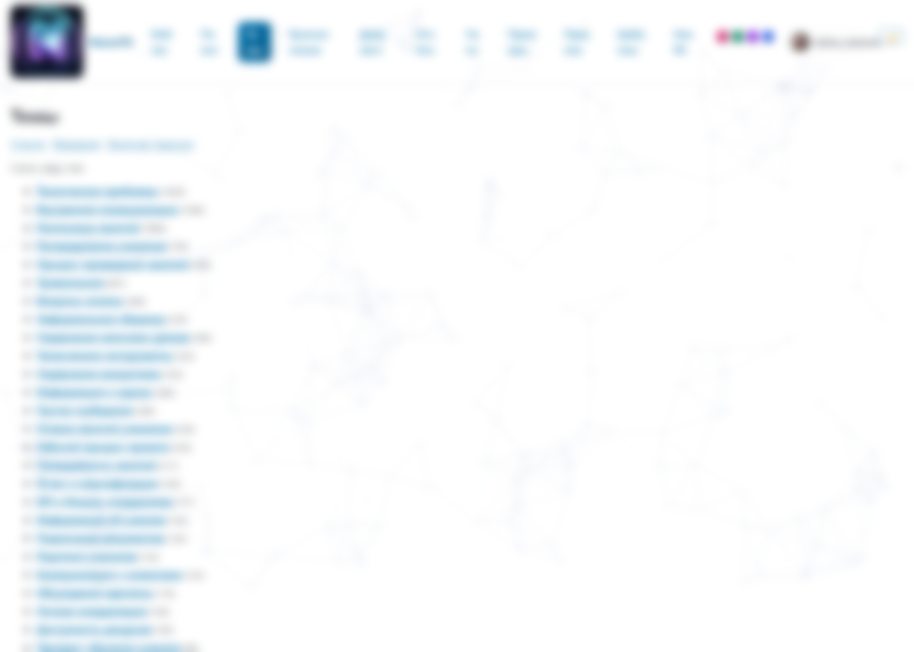
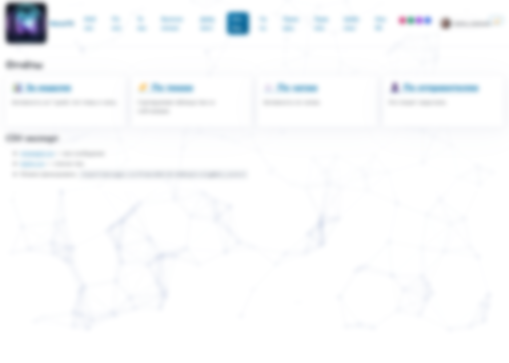
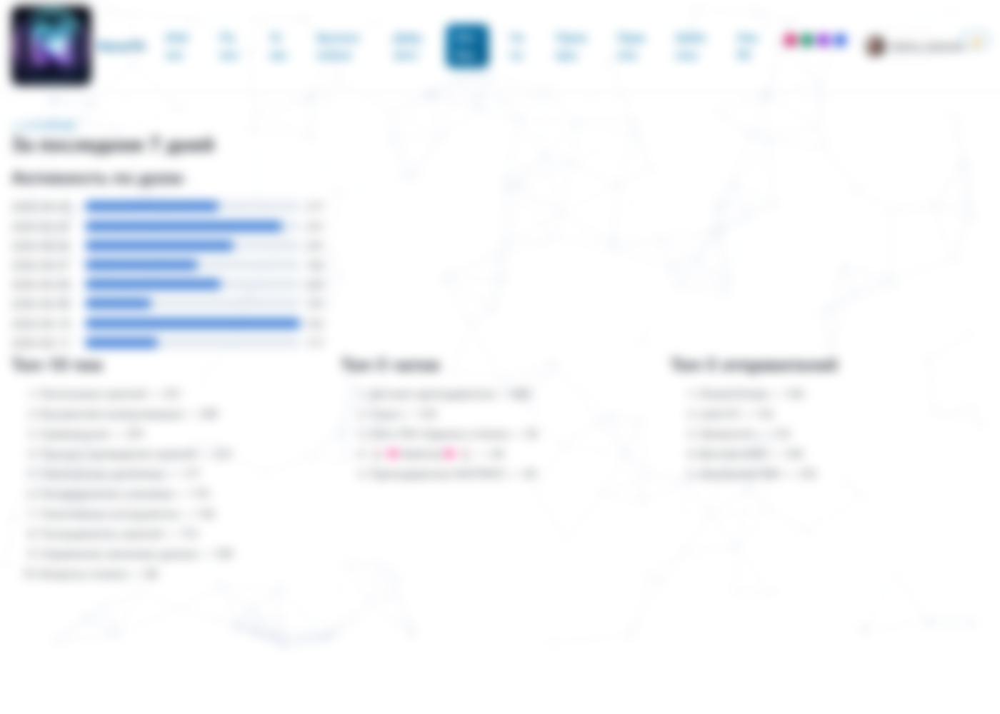
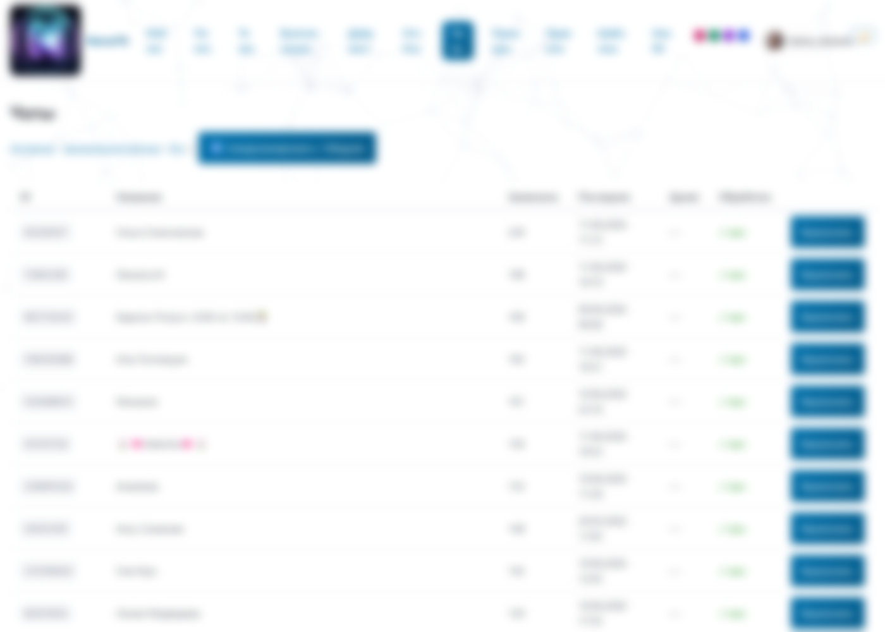
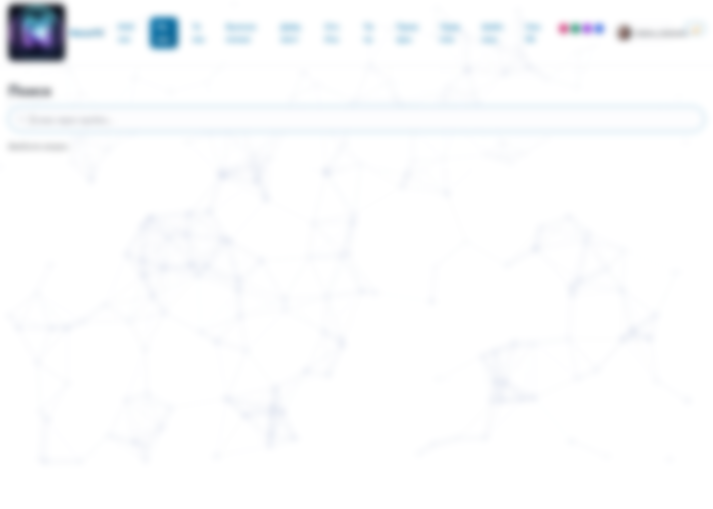

# NexusTG

**Локальный агрегатор Telegram-сообщений с LLM-классификацией, веб-интерфейсом и умными уведомлениями.**

NexusTG слушает ваш аккаунт Telegram, выбирает только то, что действительно требует внимания (ЛС, упоминания, ответы вам), автоматически классифицирует сообщения по темам через LLM (Gemini / Grok / любой OpenAI-совместимый API) и показывает чистый inbox в локальном веб-интерфейсе. Никаких облаков — данные, сессия и БД остаются на вашем компьютере.

---

## Возможности

- **Сбор сообщений из Telegram.** Один Telethon-клиент слушает все диалоги; захватываются ЛС, @упоминания и ответы на ваши сообщения. Broadcast-каналы игнорируются.
- **Контекст ±5 сообщений** сохраняется вокруг каждого захваченного — чтобы понимать о чём речь.
- **Backfill за 30 дней** при первом запуске, устойчив к перезапуску.
- **Edit/delete-трекинг.** Правки складываются в `raw_json.edits[]`, удаления — soft-delete.
- **LLM-классификация (Gemini / Grok / OpenAI-совместимое API).** Каждое сообщение получает тему, приоритет (u/i) и оценку, с бюджетом токенов в день.
- **Иерархия тем** с merge, set-parent, историей сообщений; обучающие примеры подмешиваются в системный промт.
- **Веб-интерфейс (FastAPI + Jinja + Pico.css):** inbox, поиск, отчёты (weekly/topics/chats/senders), CSV-экспорт, правила, шаблоны ответов.
- **Уведомления:** Windows toast, self-ЛС в Telegram, отдельный Telegram-бот для inbox-пушей.
- **Полностью локально.** Всё под `./data/` (`app.db`, `tg.session`, `logs/`). Никаких записей в `%APPDATA%`.

---

## Скриншоты

> Личные данные на скринах размыты, UI-каркас сохранён.

| Inbox | Темы (дерево) |
|---|---|
|  |  |

| Отчёты | Weekly-отчёт |
|---|---|
|  |  |

| Чаты (allow/block) | Поиск |
|---|---|
|  |  |

---

## Стек

- Python 3.12, `uv` для окружения
- [Telethon](https://github.com/LonamiWebs/Telethon) — клиент Telegram MTProto
- SQLite (aiosqlite) — хранилище
- FastAPI + Uvicorn + Jinja2 — веб
- OpenAI-совместимый клиент → Gemini / Grok / OpenAI / любой совместимый эндпоинт
- Windows-Toasts — нативные уведомления Windows

---

## Требования

- **Windows 11**, PowerShell 5.1+
- **Python 3.12** (поставит `uv`)
- **`uv`** — менеджер окружения:
  ```powershell
  winget install astral-sh.uv
  # или
  irm https://astral.sh/uv/install.ps1 | iex
  ```
- **Telegram API**: `api_id` и `api_hash` с https://my.telegram.org
- (Опционально) API-ключ LLM-провайдера для классификации

---

## Быстрый старт

```powershell
# 1. Клон и переход
git clone https://github.com/sigurt33/NexusTG.git
cd NexusTG

# 2. Конфиг секретов
copy .env.example .env
# Открыть .env и заполнить:
#   TG_API_ID, TG_API_HASH       — обязательно
#   XAI_API_KEY                  — для классификации (можно позже)
#   TG_BOT_TOKEN, TG_MY_ID       — для inbox-бота (опционально)

# 3. Установка + первичный логин
.\setup.ps1
# Введите телефон (+...), код из Telegram. При 2FA — пароль.

# 4. Запуск ingestion
.\run.ps1

# 5. Веб-интерфейс (в отдельном окне)
.\web.ps1
# Откроется на http://127.0.0.1:8000
```

Проверка: через 5 минут в `data/app.db` должны появиться строки в таблице `messages`.

---

## Конфигурация (`config.toml`)

```toml
timezone = "Europe/Minsk"
active_hours_start = "10:00"
active_hours_end   = "18:30"
backfill_days      = 30
context_window     = 5

notify_windows_toast = true
notify_tg_self       = true
notify_tg_bot        = false

ui_lang  = "ru"

# LLM (по умолчанию — Gemini через OpenAI-совместимый эндпоинт)
grok_model               = "gemini-2.5-flash"
llm_base_url             = "https://generativelanguage.googleapis.com/v1beta/openai/"
grok_daily_token_budget  = 20000000
llm_input_usd_per_m      = 0.075
llm_output_usd_per_m     = 0.30
```

Чтобы переключиться на Grok или OpenAI — поменяйте `llm_base_url` и `grok_model`, ключ кладите в `XAI_API_KEY`.

---

## CLI

```powershell
uv run python -m app.cli login    # вход в Telegram
uv run python -m app.cli run      # ingestion (backfill + realtime + classifier)
uv run python -m app.cli bot      # запустить только Telegram-бота
uv run python -m app.cli backup   # zip-бэкап data/ в ./backups/
```

`run` запускает листенер, классификатор и (если задан `TG_BOT_TOKEN`) бота вместе.

---

## Веб-интерфейс

После `.\web.ps1` → http://127.0.0.1:8000

Ключевые маршруты:

| Раздел | Путь |
|---|---|
| Inbox | `/` |
| Поиск | `/search` |
| Чаты (allow/block) | `/chats` |
| Темы (дерево, merge) | `/topics?view=tree` |
| История темы | `/topics/{id}/messages` |
| Отчёты | `/reports`, `/reports/weekly`, `/reports/topics`, `/reports/chats`, `/reports/senders` |
| Обучающие примеры | `/examples` |
| Правила | `/rules` |
| Шаблоны ответов | `/templates` |
| Экспорт CSV | `/export/messages.csv?from=&to=&topic=&chat=&min_score=`, `/export/topics.csv` |
| Health | `/health` |

Действия над сообщением: `/message/{id}/reclassify`, `/message/{id}/priority`, `/message/{id}/save-example`.

---

## Telegram-бот для уведомлений

1. Создайте бота: @BotFather → `/newbot`.
2. В `.env`: `TG_BOT_TOKEN=...`, `TG_MY_ID=...` (узнать через @userinfobot).
3. В `config.toml`: `notify_tg_bot = true`.
4. Бот стартует автоматически в `run`-режиме; отдельный запуск — `uv run python -m app.cli bot`.

Бот шлёт уведомления **только** на `TG_MY_ID`.

---

## Структура проекта

```
NexusTG/
  app/             — config, db, CLI, schema.sql
  ingestion/       — Telegram-листенер, backfill, chats-sync, контекст
  classifier/      — Grok/Gemini-воркер, промты, нормализация тем, консолидация
  web/             — FastAPI + Jinja-шаблоны + статика
  bot/             — Telegram-бот (inbox-уведомления)
  notifications/   — Windows toast, self-ЛС, планировщик, outbox-sender
  data/            — app.db, tg.session, logs/ (gitignored)
  logo/            — ассеты
  config.toml      — таймзона, окна активности, LLM-настройки
  .env             — секреты (gitignored)
  setup.ps1 / run.ps1 / web.ps1 / migrate.ps1  — Windows-launcher’ы
```

Подробности по архитектуре и миграциям: [`GUIDE.md`](GUIDE.md), [`MIGRATE.md`](MIGRATE.md), [`REPORT.md`](REPORT.md).

---

## Безопасность

- `data/tg.session` = **полный доступ к вашему Telegram**. Не коммитьте, не выкладывайте, не пересылайте.
- `.env` с API-ключами также игнорируется git'ом.
- `data/`, `.env`, `backups/` уже в `.gitignore`.
- Бэкап: `uv run python -m app.cli backup` → `./backups/data_YYYYMMDD_HHMM.zip`.

---

## Перенос на другой ПК

1. Скопировать целиком папку проекта **вместе с `data/`** (там сессия и БД).
2. Поставить `uv`.
3. `.\setup.ps1` — увидит существующую сессию и не будет спрашивать код.
4. `.\run.ps1`.

> ⚠️ **Не запускайте сервис одновременно на двух ПК с одной сессией** — Telegram её отзовёт, придётся логиниться заново.

---

## Статус

Phase 5: ingestion + LLM-классификация + веб + бот + отчёты + CSV-экспорт + обучающие примеры.

---

## Лицензия

Личный проект. Лицензия не выбрана — права на код принадлежат автору.
